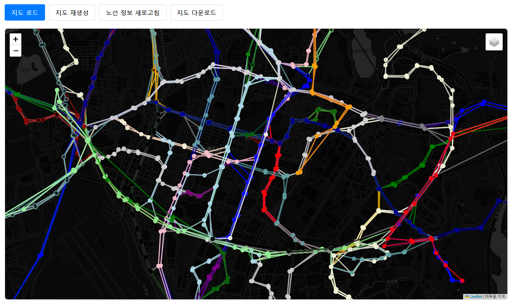

# 버스 정보 시스템 (MVC 패턴)

Flask 기반의 버스 정보 시스템으로, MVC(Model-View-Controller) 패턴을 적용하여 구조화된 웹 애플리케이션입니다.

## 프로젝트 데모



## 프로젝트 구조

```
bus/
├── app/                    # 애플리케이션 메인 디렉토리
│   ├── __init__.py        # Flask 앱 초기화
│   ├── models/            # Model (데이터 모델)
│   │   ├── __init__.py
│   │   ├── user.py        # 사용자 모델
│   │   └── bus.py         # 버스 관련 모델
│   ├── views/             # View (라우트/컨트롤러)
│   │   ├── __init__.py
│   │   ├── auth.py        # 인증 관련 라우트
│   │   ├── bus.py         # 버스 API 라우트
│   │   ├── teams.py       # 팀별 페이지 라우트
│   │   └── main.py        # 메인 페이지 라우트
│   ├── controllers/       # Controller (비즈니스 로직)
│   │   ├── __init__.py
│   │   ├── auth_controller.py
│   │   ├── bus_controller.py
│   │   ├── map_controller.py
│   │   └── team2_controller.py  # Team2 전용 컨트롤러
│   ├── services/          # Service (서비스 레이어)
│   │   ├── __init__.py
│   │   ├── auth_service.py
│   │   ├── bus_service.py
│   │   ├── map_service.py
│   │   └── data_service.py      # Team2 DB 통합
│   ├── schemas/           # Schema (데이터 검증)
│   │   ├── __init__.py
│   │   ├── auth_schema.py
│   │   └── bus_schema.py
│   └── utils/             # Utils (유틸리티)
│       ├── __init__.py
│       ├── database.py    # 데이터베이스 연결
│       └── helpers.py     # 헬퍼 함수들
├── config/                # 설정 파일들
│   ├── __init__.py
│   └── settings.py
├── static/                # 정적 파일들
├── templates/             # 템플릿 파일들
│   ├── team2.html         # Team2 통합 템플릿
│   └── ...
├── data/                  # 데이터 파일들
├── map/                   # 지도 관련 파일들
├── requirements.txt       # 의존성 파일
└── run.py                 # 애플리케이션 실행 파일
```

## MVC 패턴 구조

### Model (모델)
- **User**: 사용자 정보 모델
- **BusRoute**: 버스 노선 모델
- **BusStop**: 버스 정류장 모델

### View (뷰)
- **auth.py**: 인증 라우트 (`/auth/login`, `/auth/logout`, `/auth/register`)
- **bus.py**: 버스 API 라우트 (`/api/bus`, `/api/bus-stops`, ...)
- **teams.py**: 팀별 페이지 라우트 (`/team1`, `/team2`, ...)
- **main.py**: 메인 페이지 라우트 (`/`)

### Controller (컨트롤러)
- **AuthController**: 인증 관련 비즈니스 로직
- **BusController**: 버스 관련 비즈니스 로직
- **MapController**: 지도 관련 비즈니스 로직
- **Team2Controller**: Team2 노선별 교통량 분석 로직

### Service (서비스)
- **AuthService**: 사용자 인증 및 관리 서비스
- **BusService**: 버스 정보 조회 서비스
- **MapService**: 지도 데이터 서비스
- **DataService**: 데이터 로드 및 처리 서비스 (Team2 DB 통합)

### Schema (스키마)
- **auth_schema.py**: 인증 관련 폼 스키마
- **bus_schema.py**: 버스 데이터 스키마

## 설치 및 실행

### 1. 의존성 설치
```bash
pip install -r requirements.txt
```

### 2. 환경 설정
- `config/settings.py`에서 데이터베이스 및 API 설정 확인
- 필요한 경우 `.env` 파일 생성

### 3. 애플리케이션 실행
```bash
python run.py
```

## 주요 기능

### 인증 시스템
- 사용자 회원가입/로그인/로그아웃
- 세션 기반 인증
- 비밀번호 해시화

### Team2 - 노선별 교통량 분석
- **데이터베이스 연동**: CloudType MariaDB에서 실시간 데이터 조회
- **노선별 분석**: 상위 4개 노선의 교통량 데이터 분석
- **시각화**: Chart.js를 활용한 시간대별 평균 이용객수 차트
- **인터랙티브**: 사이드바를 통한 노선 선택 및 실시간 데이터 필터링
- **API 엔드포인트**:
  - `/api/team2/data`: 전체 데이터 통계
  - `/api/team2/route/<route_name>`: 특정 노선 데이터
  - `/api/team2/chart`: 차트 데이터

### 버스 정보 시스템
- 버스 노선 정보 조회
- 정류장 정보 제공
- 실시간 데이터 처리

### 지도 시스템
- Folium 기반 인터랙티브 지도
- 버스 노선 시각화
- 정류장 위치 표시

## API 엔드포인트

### 인증 API (Blueprint: `auth`)
- `POST /auth/login`: 로그인
- `POST /auth/logout`: 로그아웃
- `POST /auth/register`: 회원가입

### 버스 API
- `GET /api/bus`: 버스 노선 정보
- `GET /api/bus-stops`: 버스 정류장 정보

### Team2 API
- `GET /api/team2/data`: Team2 전체 데이터 통계
- `GET /api/team2/route/<route_name>`: 특정 노선 상세 데이터
- `GET /api/team2/chart?route=<route_name>`: 차트 데이터

### 팀별 페이지
- `GET /team1`: Team1 페이지
- `GET /team2`: Team2 노선별 교통량 분석
- `GET /team3`: Team3 페이지
- `GET /team4`: Team4 지도 페이지
- `GET /team5`: Team5 회원가입 페이지

## 데이터베이스 설정

### Team2 데이터베이스
- **호스트**: svc.sel5.cloudtype.app
- **포트**: 32134
- **데이터베이스**: flask_bus
- **테이블**: suwon_bus_stop_2024

### 데이터 전처리
- 이용객수: 숫자형 변환
- 시작시간: 숫자형 변환
- 노선: 문자열 정규화

## 기술 스택

- **Backend**: Flask, Python 3.10+
- **Database**: MariaDB (CloudType)
- **Frontend**: Bootstrap 5, Chart.js
- **Maps**: Folium
- **Authentication**: Flask-WTF, bcrypt
- **Data Processing**: pandas, PyMySQL

## 개발 가이드

### 새로운 기능 추가
1. Model: `app/models/`에 데이터 모델 정의
2. Service: `app/services/`에 비즈니스 로직 구현
3. Controller: `app/controllers/`에 컨트롤러 생성
4. View: `app/views/`에 라우트 정의
5. Template: `templates/`에 HTML 템플릿 작성

### 데이터베이스 연결
- Team2 전용 데이터베이스는 `DataService`의 `Database` 클래스 사용
- 기존 데이터는 `DataService`의 CSV 로드 메서드 사용

## 라이센스

이 프로젝트는 교육 목적으로 개발되었습니다.
